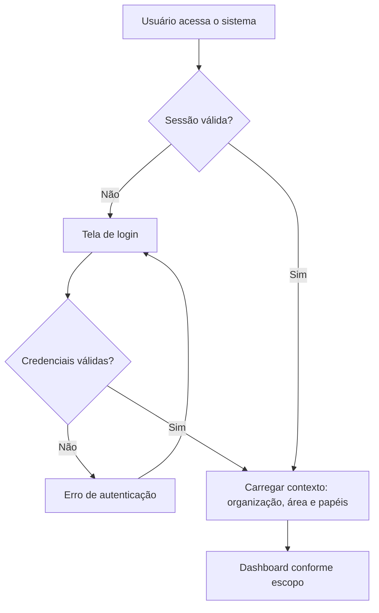
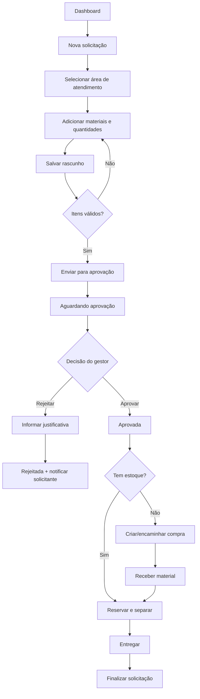
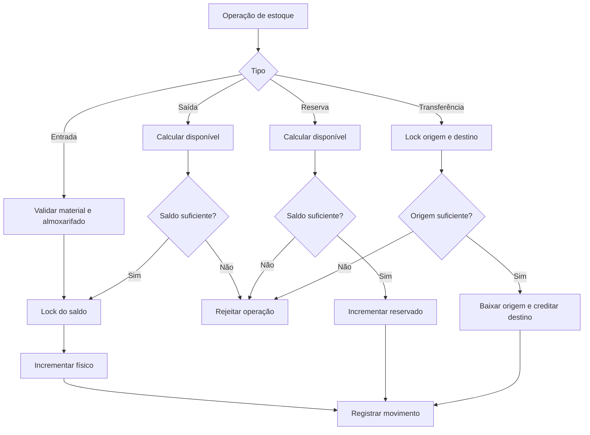
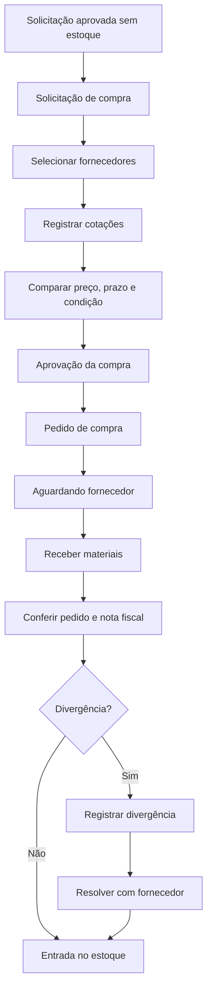
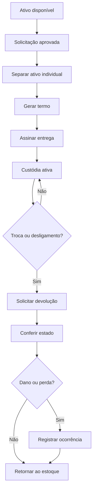

# App Flow — Gestão de Materiais

## 1. Entrada no sistema



## 2. Solicitação interna



## 3. Estoque



## 4. Compra



## 5. TI — custódia de ativo



## 6. Perfis e navegação

```text
Administrador
 ├── Dashboard global
 ├── Usuários e papéis
 ├── Todas as áreas
 ├── Auditoria
 └── Configurações

Gestor de área
 ├── Dashboard da área
 ├── Solicitações para aprovação
 ├── Materiais da área
 └── Relatórios do escopo

Estoquista
 ├── Estoque
 ├── Entrada
 ├── Saída
 ├── Transferência
 ├── Reservas
 └── Separação

Solicitante
 ├── Nova solicitação
 ├── Minhas solicitações
 └── Minhas entregas

Comprador
 ├── Compras
 ├── Cotações
 ├── Fornecedores
 └── Recebimento
```

## 7. Estados obrigatórios de interface

Todo fluxo deve possuir:

- Carregando;
- Vazio;
- Sucesso;
- Erro recuperável;
- Erro de permissão;
- Conflito de estado;
- Operação duplicada;
- Confirmação antes de ação irreversível.
